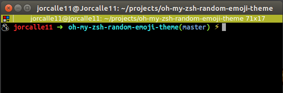

oh-my-zsh Emoji theme [](https://github.com/shinji62/oh-my-zsh-random-emoji-theme/blob/master/LICENCE)
====

Take emoji randomly in 💩 🐦 🚀 🐞 🎨 🍕 🐭 👽 ☕️ 🔬 💀 🐷 🐼 🐶 🐸 🐧 🐳 🍔 🍣 🍻 🔮 💰 💎 💾 💜 🍪 🌞 🌍 🐌 🐓 🍄 🍺



## Install

After installing [oh-my-zsh](https://github.com/robbyrussell/oh-my-zsh), you can install this by:

```bash
$ curl -fsSL https://raw.github.com/jorcalle11/oh-my-zsh-random-emoji-theme/master/random-emoji.zsh-theme >> ~/.oh-my-zsh/themes/random-emoji.zsh-theme
```

And configure `.zshrc`:

```bash
ZSH_THEME="random-emoji"
```

## Fork

This theme is fork from [random-emoji.zsh-theme](https://github.com/shinji62/oh-my-zsh-random-emoji-theme/blob/master/random-emoji.zsh-theme). 

## Author

[shinji62](https://github.com/shinji62)
